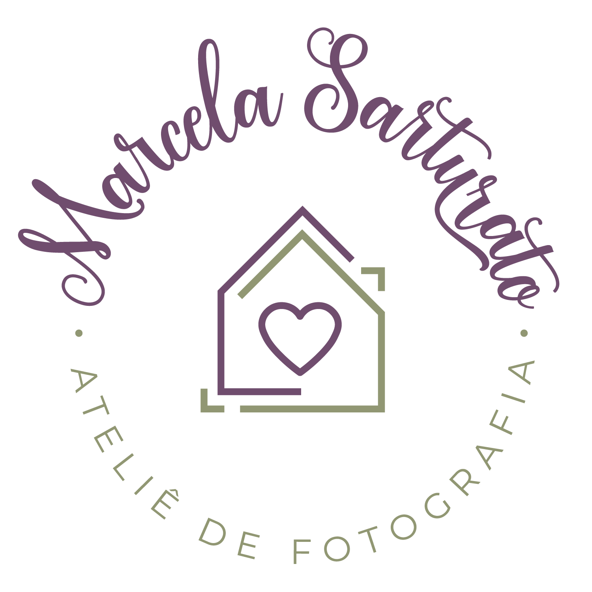

Esse foi desenvolvido em [Next.js](https://nextjs.org/) com o pacote [`create-next-app`](https://github.com/vercel/next.js/tree/canary/packages/create-next-app).

Desenvolvido por [CanedoDev](https://portfoliocanedo.vercel.app) 💻

## Projeto Marcela Sarturato



Iinformações adicionais sobre o Atelie Marcela Sarturato:

```bash
# nome
Atiele Marcela Sarturato
# Endereco
Piumhi | MG
# Contato
@masarturato.foto
```

## To Do

[X] Carregamento de Imagens especificas [Web/Mobile]
[X] Links icons Redes Sociais [Web/Mobile]
[X] Aumentar tamanho da fonte [Web]
[X] Distancia entre elementos [Web]
[X] Setas Carrosel [Web/Mobile]
[] Espaço no Início das páginas [Web]

## Learn More

To learn more about Next.js, take a look at the following resources:

- [Next.js Documentation](https://nextjs.org/docs) - learn about Next.js features and API.
- [Learn Next.js](https://nextjs.org/learn) - an interactive Next.js tutorial.

You can check out [the Next.js GitHub repository](https://github.com/vercel/next.js/) - your feedback and contributions are welcome!


